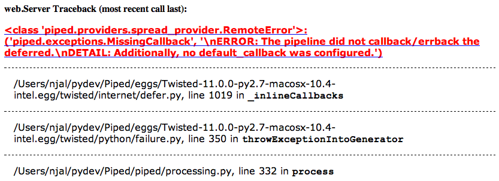
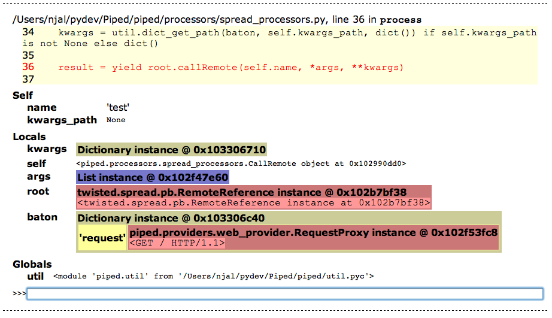
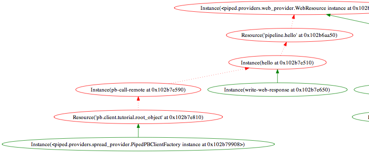

Getting started
===============

This tutorial assumes that you have successfully :doc:`installed piped </installing>`.

In this tutorial, we're going to create a small web server, expand it by communicating with a backend
server and perform some simple visualization.

Creating your first configuration
---------------------------------

Save the following configuration to a file ``tutorial.yaml``:

.. literalinclude:: 1_static/tutorial.yaml
    :language: yaml

Running piped with your configuration
^^^^^^^^^^^^^^^^^^^^^^^^^^^^^^^^^^^^^

In this tutorial, we will use the following switches to :ref:`topic-piped-daemon`.

    * :option:`-n <piped -n>` in order to avoid daemonizing.
    * :option:`-c <piped -c>` in order to specify the configuration file to use.

To run :program:`piped` with the configuration file we just created, we run the following in a terminal:

.. code-block:: bash

    $ piped -nc tutorial.yaml

Open your web browser to http://localhost:8080, and you should see a directory listing of the directory we started the process in.

What did we just do?
^^^^^^^^^^^^^^^^^^^^

We created a :doc:`configuration file </topic/configuration>` that specifies what the :program:`piped` process should do.
In this configuration file, we used one of the available :doc:`providers </reference/providers>`. Providers can provide inputs,
outputs or resources to a process.

The :mod:`web provider <piped.providers.web_provider>`, used in the above configuration, allows us to create one or more web sites
within our process. The sites contains a routing configuration that we use to map incoming requests to specific actions.

In our site routing configuration we specified a single static resource that serves the contents of the current directory.
In the next section we will extend this example by introducing pipelines.

Creating your first pipeline
----------------------------

In this section, we will create a pipeline that returns the string ``Hello from a pipeline.`` to any visiting web browser.

In order to do that, we must configure the web site routing to use a pipeline to handle the web request and create the pipeline.
Edit ``tutorial.yaml`` to look like this:

.. literalinclude:: 2_pipeline/tutorial.yaml
    :language: yaml

Using your first pipeline
^^^^^^^^^^^^^^^^^^^^^^^^^

To use the new configuration, simply restart the :program:`piped` process we started in the previous step, refresh
http://localhost:8080, and you should be greeted by your hearty message.

What did we just do?
^^^^^^^^^^^^^^^^^^^^

We created the pipeline ``hello`` containing two processors: :ref:`set-value` and :ref:`write-web-response` and
configured our web site to render the root resource by using the ``hello`` pipeline.

A pipeline is a directed graph of processors. Every pipeline has one or more sources that serve as entry
points to the processor graph. When the pipeline is asked to process a baton, it gives that baton to each of
the source processors.

In relay races, a baton is passed from runner to runner. In piped, the runners are processors and the baton may
be any Python object. The type and contents of a baton is always defined by the invoker of the pipeline.

Each procesor may have zero or more consumers. The consumers are processors that receive the baton from
their parent processor. The processors may mutate, replace or pass the baton along unchanged as part of their
processing. The processors are also able to stop the processing or only use a certain subset of their
configured consumers.

When a client visits the root resource, the pipeline is invoked by the web provider
with a :class:`dict` that contains the request. The request is an :class:`twisted.web.server.Request` instance.

The set-value processor sets the ``content`` key of the baton to the message, and the write-web-response processor
writes the value of the ``content`` key to the client:

.. digraph:: internal_dependencies
    :caption: The green labels are batons that are being passed through the pipeline.

    client [shape="square"]
    "web site" [shape=circle]

    { rank=same; client -> "web site" [label="request"] }

    "web site" -> "set-value" [label="dict(request=...)", fontcolor=green]

    subgraph hello {
        "set-value" -> "write-web-response" [label="dict(content='Hello from a pipeline.', request=...)", fontcolor="green"]
    }

    "write-web-response" -> client [label="content", labelloc="left"]

This shows a common way processors work with each other: a processor sets one or more values in the baton, which is
used by a processor later in the processing graph.

Extending piped with a processor
--------------------------------

While piped comes with a lot of useful processors, many cases will require specialized processors that perform specialized
tasks.

In this section we will have a brief look at how to extend piped with your own processors by creating a processor that
uppercases its input.

In order to use a custom test processor, we must create a package that piped can search for test processors in. Create the following directory structure:

.. code-block:: bash

    # tutorial.yaml        # our web server
    # tutorial_bundle/     # our python package
    #     __init__.py      # empty file that makes tutorial_bundle a python package
    #     processors.py    # we'll add our custom processor here.

    $ mkdir tutorial_bundle
    $ touch tutorial_bundle/__init__.py

Before piped can load custom processors, we must configure it to look for plugins in our package. In piped, we call
a collection of packages that may contain plugins "bundles". To add a bundle to our piped configuration, we add the
following to our ``tutorial.yaml`` file:

.. literalinclude:: 3_processor/tutorial.yaml
    :start-after: pipeline: hello
    :end-before: pipelines:
    :language: yaml

Creating a custom processor
^^^^^^^^^^^^^^^^^^^^^^^^^^^

We can now create our first custom processor in ``tutorial_bundle/processors.py``:

.. literalinclude:: 3_processor/tutorial_bundle/processors.py

Our first processor is a subclass of :class:`~piped.processors.base.InputOutputProcessor`, which takes care of getting the input
from the baton and assigning the returned value in the baton We only need to implement
:meth:`~piped.processors.base.InputOutputProcessor.process_input`. By default, the output path will be the same as the input path, so
to use this processor in our pipeline, we only need to specify where it will find the text it should process.

Using our custom processor
^^^^^^^^^^^^^^^^^^^^^^^^^^

Add the ``uppercase`` processor to the ``hello`` pipeline in ``tutorial.yaml``, and should now look like this:

.. literalinclude:: 3_processor/tutorial.yaml
    :language: yaml

If we try to restart piped now, we will get the following exception:

.. code-block:: bash

    $ piped -nc tutorial.yaml
    [...]
        piped.exceptions.ConfigurationError:
        ERROR: No module named 'tutorial_bundle'
        DETAIL: 'tutorial_bundle' does not seem to be a valid package.
        HINT: Ensure that sys.path is set correctly.

We get this exception because we just told piped to look for plugins in a package named ``tutorial_bundle``, but we didn't add
the current directory to ``sys.path``. To remedy this, we can use the ``PYTHONPATH`` environment variable before starting
piped:

.. code-block:: bash

    # either before starting piped:
    $ export PYTHONPATH=.
    $ piped -nc tutorial.yaml
    ...
    # or inline:
    $ PYTHONPATH=. piped -nc tutorial.yaml

Restart piped with the correct ``sys.path`` and refresh http://localhost:8080 and you should see your greeting again, but this
time it should be in all uppercase.

Communicating between servers
-----------------------------

In order to create servers that can communicate between each other, we first need to choose a communication protocol. There are a lot of
different options, just to name some:

* HTTP - Stateless protocol that can be used for sending simple requests, or can be extended with simple
    remote procedure calls using XMLRPC etc.

* Perspective Broker - As the `twisted documentation <http://twistedmatrix.com/documents/current/core/howto/pb-intro.html>`_ puts it:

    *Suppose you find yourself in control of both ends of the wire:
    you have two programs that need to talk to each other, and you get to use any protocol you want. If you can think of your
    problem in terms of objects that need to make method calls on each other, then chances are good that you can use Twisted's
    Perspective Broker protocol rather than trying to shoehorn your needs into something like HTTP, or implementing yet
    another RPC mechanism.*

* Message queues - For example `ZeroMQ <http://zeromq.org>`_, which can be used to efficently enable
    many different communication methodologies, for example one-to-one and group messaging.

In this tutorial, we will use perspective broker because it uses a persistent connection between the client and the server
which will later enable us to show how piped handles dependencies that may come and go.

First, we create a perspective broker server that does nothing. Create a new configuration file, ``pb-server.yaml``:

.. literalinclude:: 4_communicating/pb-server.yaml
    :language: yaml

The :ref:`passthrough` processor is a processor that does nothing but give the input baton to its consumers, and is the
piped equivalent of Pythons ``pass`` statement. We need to use that processor here because a pipeline without processors
is invalid.

Then we tell our web server to get the page contents from the perspective broker server by adding a perspective broker
client to our server. The client will automatically reconnect if the server goes does down, using exponential back-off.
Edit the ``tutorial.yaml`` configuration file to look like this:

.. literalinclude:: 4_communicating/tutorial.yaml
    :language: yaml

Start these two servers as separate processes:

.. code-block:: bash

    $ piped -nc pb-server.yaml

.. code-block:: bash

    $ export PYTHONPATH=.
    $ piped -nc tutorial.yaml

By opening http://localhost:8080 now, you will be greeted by a rather unfriendly **Processing Failed** message. In the
next section, we will take a closer look at exactly what is happening now, why it is happening, and what we can do to make
it work properly.

Understanding what is happening
^^^^^^^^^^^^^^^^^^^^^^^^^^^^^^^

Since we haven't allowed anyone to debug failures on the web server, it renders a generic **Processing Failed** message
if the processing raises an exception. The first thing we do, is to allow ourselves to debug by adding ``localhost`` to
the list of clients that are allowed to debug:

.. literalinclude:: 4_communicating/tutorial_allow.yaml
    :end-before: routing

.. warning:: Clients that are given access to debugging have the ability to execute arbitrary code in the piped
    process. Use this ability with extra care and avoid enabling this in a production environment.

Restart the web server and refresh http://localhost:8080, and you should see a page like this:

At the top of the traceback we can see the exception class and message.

Scroll down and click the last traceback line and you will find an overview of the local variables in addition to
being able to execute arbitrary statements to further inspect the state of the baton and processor where the exception
was raised.

Feel free to explore with a little this interactive console before continuing the rest of this tutorial. Remember
that any changes you do to the processor instance and other persistent objects will only be in effect until
you restart the process.

In this case, we can see that the exception was raised when we were calling the remote function ``test``. By looking
at the exception message in the web server traceback or the perspective broker server logs, we see that
the pipeline on the perspective broker server isn't callbacking the deferred. The documentation for the
:mod:`perspective broker provider <piped.providers.spread_provider>`
states that the baton it sends to the pipeline contains a :class:`~twisted.internet.defer.Deferred` that should be
callbacked with a result.

We fix this by replacing the ``passthrough`` processor the ``pb-server`` pipeline in ``pb-server.yaml`` with a
processor that actually callbacks the deferred:

.. literalinclude:: 4_communicating/pb-server-with-callback.yaml
    :language: yaml
    :start-after: pipelines:

Restart the perspective broker server (the web server does not require restarting, as it will automatically
reconnect to the restarted pb server after a couple of seconds) and refresh http://localhost:8080 to see the greeting
from the backend server.

If you receive an exception with a message similar to ``Resource('pipeline.hello' at 0x...) has no resource.``, just wait a few more seconds
for the web server to reestablish its connection to the perspective broker server. The default max delay between reconnect
attempts is around 30 seconds.

Visualizing
------------

In this section we will visualize some central elements in a piped process.

.. note:: If you haven't already, stop both the web server and the perspective broker server before continuing this section.

Installing Graphviz
^^^^^^^^^^^^^^^^^^^

Go to `Graphviz.org <http://www.graphviz.org/Download.php>`_ and download the latest Graphviz version for your system, and ensure
that :program:`dot` is in your ``PATH`` before continuing:

.. code-block:: bash

    $ dot -V
    dot - graphviz version 2.26.3 (20100126.1600)

Pipelines
^^^^^^^^^

In order to visualize the pipelines, we use the :ref:`diagram-pipelines` processor to create a textual
representation of the pipelines that ``dot`` can draw. We pass this representation to the :ref:`render-dot`
processor that renders the graph. To view this graph in a modern web browser we use the :ref:`write-web-response`
processor, specifying that the content is a scalable vector graph.

Create a file ``visualize-pipelines.yaml`` with the following contents:

.. literalinclude:: 5_visualizing/visualize-pipelines.yaml
    :language: yaml

Add the ``visualize-dependencies.yaml`` file to the ``includes`` of the ``tutorial.yaml`` file:

.. literalinclude:: 5_visualizing/tutorial.yaml
    :language: yaml
    :end-before: visualize-dependencies.yaml

The ``includes`` part of a configuration is a list of files that should be loaded before the current file. Their
contents is loaded sequentially and any conflicting leaf options are overridden by the latter configurations.

Restart the web server and open http://localhost:8080/pipelines and you should see a visualization of all the
pipelines that looks like this:

.. digraph:: visualized_pipelines

    subgraph cluster_web_pipelines {
        label = "web.pipelines";
        
        "diagram-pipelines" [color=green]
        "render-dot" [color=green]
        "pipelines.write-web-response" [label="write-web-response", color=green]

        "diagram-pipelines" -> "render-dot" -> "pipelines.write-web-response"
    }

    subgraph cluster_hello {
        label = "hello";
        shape = box;

        "pb-call-remote" [color=green]
        "hello.write-web-response" [label="write-web-response", color=green]
        uppercase [color=green]

        "pb-call-remote" -> uppercase -> "hello.write-web-response"
    }

Dependencies
^^^^^^^^^^^^

We can visualize the internal dependencies of a process in much the same way as we visualized the
pipelines, except we use a the :ref:`diagram-dependencies` processor to create the textual graph
representation.

Create a file ``visualize-dependencies.yaml`` with the following contents:

.. literalinclude:: 5_visualizing/visualize-dependencies.yaml
    :language: yaml

Add the ``visualize-dependencies.yaml`` file to the ``includes`` of the ``tutorial.yaml`` file:

.. literalinclude:: 5_visualizing/tutorial.yaml
    :language: yaml
    :end-before: web:

Restart the web server and open http://localhost:8080/dependencies and you should see a visualization of all the
dependencies that looks like this:

Red lines indicates dependencies that are unavailable to their consumers and red circles indicates dependencies that are
considered lost/unavailable.

Experiment with starting and stopping the perspective broker server and refreshing the dependency visualization to see
the effect of dependencies that come and go.

Testing
-------

In this section we will learn how to test pipelines.

This section uses :doc:`status tests </topic/testing>`, which is part of the ``piped_status_testing`` package,
which must be installed before this section can be completed.

These tests are not to the same as unit tests. You would use unit tests to test Python code, such as custom
processors etc while you would use status tests to test pipeline configurations. Status tests uses the same API
as unit tests, but is adapted to run inside a piped process. These tests have full access to the
:doc:`runtime environment </topic/runtime_environment>` which can be used to access all parts of a live piped process.

In this section we will use the status test contrib package to create system tests for the processes we've just
written.

Installing the status test contrib package
^^^^^^^^^^^^^^^^^^^^^^^^^^^^^^^^^^^^^^^^^^

Depending on how you installed piped, you may already have installed the package. To check if you have installed
the framework, simply try to import it:

.. code-block:: bash

    # if you're using buildout, use piped-python instead of python:
    $ python -c "import piped_status_testing"
    Traceback (most recent call last):
      (...)
    ImportError: No module named status_testing

If you receive the above error message, you should install the status_testing contrib package, for example by
using ``easy_install``:

.. code-block:: bash

   $ easy_install piped_status_testing

Writing a test processor
^^^^^^^^^^^^^^^^^^^^^^^^

A test processor is a custom processor that runs one or more status tests as part of its processing. A status
test is a type of unit test that runs inside an already running process. The status tests are given full access
to all parts of the process.

The easiest way to create a test processor is to subclass :class:`~piped_status_testing.processors.StatusTestProcessor`,
which takes care of building and running a test suite consisting of all the **nested classes** that are subclasses of
:class:`piped_status_testing.statustest.StatusTestCase`.

Simply create the following test processor in ``tutorial_bundle/test_processors.py``:

.. literalinclude:: 6_testing/tutorial_bundle/test_processors.py

The tests in the test case are deliberately using HTTP requests to our service instead of running individual pipelines
because we want our system tests to verify high-level functionality, and not details such as which pipelines perform
which function within a configuration.

Writing a test pipeline
^^^^^^^^^^^^^^^^^^^^^^^

We use a testing pipeline to run our tests. The only difference between any regular pipeline and a testing
pipeline is that the testing pipeline has a baton that contains a test reporter. The test reporter is used to
report the results of each of the tests that are run.

Create a new file, ``test-tutorial.yaml``, containing the following:

.. literalinclude:: 6_testing/test-tutorial.yaml
    :language: yaml

Until now, we haven't considered exceptions in pipelines. Processor graphs are created by letting any processor
have any number of consumers. The consumers are processors that receive the output from the parent processor. This
works well most of the time, but when exceptions occur, we switch to using a different set of consumers instead: the
*error consumers*. The error consumers work in the exact same way as regular processors, except they are being run
from inside an except-clause. This means that there is an exception available in their scope, accessible via regular
Python mechanics, such as :func:`sys.exc_info` and :class:`twisted.python.failure.Failure`.

In the ``system-testing.start`` pipeline, we use a list of processors in ``chained_consumers``. If the processing
reaches the :ref:`shutdown` processor, the process stops. However, if any of the processors
in raises an exception, the ``chained_error_consumers`` will be used. The error consumer uses
:ref:`print-failure-traceback` to simply print the traceback of the current exception, then :ref:`shutdown` the process.

For a more detailed explanation of how pipelines are defined and how error consumers work, see :doc:`/topic/pipelines`.

Running the tests
^^^^^^^^^^^^^^^^^

To run our test we must ensure that piped is able to find our plugin package on ``sys.path``. We do this by
ensuring that PYTHONPATH is set before running:

.. code-block:: bash

    $ PYTHONPATH=. piped -nc test-tutorial.yaml
    [-] Log opened.
    [-] twistd 11.0.0 (/Users/username/.virtualenvs/Piped/bin/python2.7 2.7.1) starting up.
    [-] reactor class: twisted.internet.selectreactor.SelectReactor.
    [-] twisted.web.server.Site starting on 8080
    [-] Starting factory <twisted.web.server.Site instance at 0x102b85998>
    [-] piped.providers.spread_provider.PipedPBServerFactory starting on 8789
    [-] Starting factory <piped.providers.spread_provider.PipedPBServerFactory instance at 0x102b91560>
    [-] Starting factory <twisted.internet.endpoints._WrappingFactory instance at 0x102e40170>
    [status_test] tutorial_testing.test_processors
    [status_test]   TestTutorial
    [status_test]     statustest_pb_server ...                                               [OK]
    [_WrappingProtocol,client] Starting factory <HTTPClientFactory: http://localhost:8080>
    [_WrappingProtocol,client]     statustest_web_server ... 127.0.0.1 - - [07/Jun/2011:12:47:00 +0000] "GET / HTTP/1.0" 200 25 "-" "Twisted PageGetter"
    [status_test]                                              [OK]
    [HTTPPageGetter,client] Starting factory <HTTPClientFactory: http://localhost:8080>
    [HTTPPageGetter,client] Stopping factory <HTTPClientFactory: http://localhost:8080>
    [-] (TCP Port 8789 Closed)
    [-] Stopping factory <piped.providers.spread_provider.PipedPBServerFactory instance at 0x102b91560>
    [_WrappingProtocol,client] Starting factory <twisted.internet.endpoints._WrappingFactory instance at 0x102edf440>
    [_WrappingProtocol,client] Stopping factory <twisted.internet.endpoints._WrappingFactory instance at 0x102e40170>
    [Uninitialized] Stopping factory <twisted.internet.endpoints._WrappingFactory instance at 0x102edf440>
    [HTTPChannel,1,127.0.0.1]     statustest_web_server_without_pb ... 127.0.0.1 - - [07/Jun/2011:12:47:00 +0000] "GET / HTTP/1.0" 500 10306 "-" "Twisted PageGetter"
    [HTTPPageGetter,client] piped.providers.spread_provider.PipedPBServerFactory starting on 8789
    [HTTPPageGetter,client] Starting factory <piped.providers.spread_provider.PipedPBServerFactory instance at 0x102b91560>
    [status_test]                                   [OK]
    [status_test]
    [status_test] -------------------------------------------------------------------------------
    [status_test] Ran 3 tests in 0.027s
    [status_test]
    [status_test] PASSED (successes=3)
    [-] (TCP Port 8789 Closed)
    [-] Stopping factory <piped.providers.spread_provider.PipedPBServerFactory instance at 0x102b91560>
    [-] (TCP Port 8080 Closed)
    [-] Stopping factory <twisted.web.server.Site instance at 0x102b85998>
    [HTTPPageGetter,client] Stopping factory <HTTPClientFactory: http://localhost:8080>
    [-] Main loop terminated.
    [-] Server Shut Down.

Since all services write to the same log file as the test reporter, the output might be a little bit messy, but we can
definitely see the three status tests are being run, the HTTP requests being executed and the perspective broker server
being temporarily stopped. Finally, we see that all the three tests successfully passed.

What's next?
------------

Going through this tutorial should have prepared you to learn more about creating providers and processors by
working with a real-life twitter example: :doc:`/tutorials/twitter/index`.

If you're more interested in learning about creating distributed services, see :doc:`/tutorials/distributing/index`.

You can read more about how to create complex pipelines in :doc:`/topic/pipelines`.

