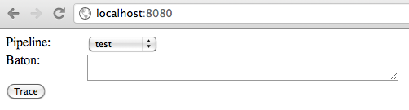
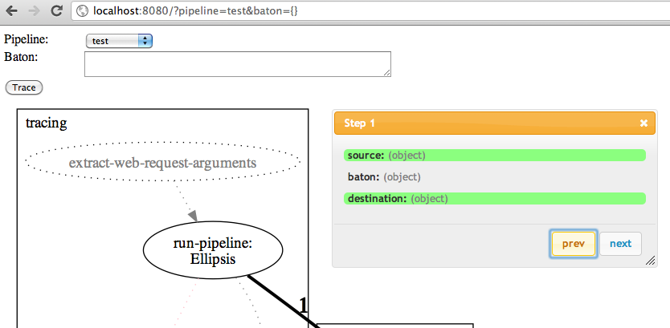

Tracing
=======

Tracing enables you to see the sequence and results of a baton as it was processed by one or more pipelines. It is a valuable tool for quickly
discovering logical errors in your configuration or getting an overview over how the pipelines are executed.

The tracing compiles a list of source/destination processors and a copy of the baton for each step the baton takes in the execution of the pipeline. In this
tutorial, we will see how this list can be used with a couple utility processors to create a simple web interface that can be used to trace all existing
pipelines within a process.

.. note:: While tracing may use significantly more memory than regular processing, adding tracing support to your existing pipelines itself does
    **not** affect the execution time or memory usage when there is currently no tracing being performed.

Tracing pipelines in a web interface
------------------------------------

In this section, we create a sample pipeline configuration and a tracing configuration that we can use to trace the sample pipelines.

Creating a sample pipeline configuration
""""""""""""""""""""""""""""""""""""""""

Start by saving the following configuration to a file ``my_pipelines.yaml``:

.. literalinclude:: my_pipelines.yaml
    :language: yaml

Exercise for the reader: See if you can understand what these pipelines will end up doing, and compare it with the results at the end of this tutorial.

Creating a tracing configuration
""""""""""""""""""""""""""""""""

Create a configuration file containing the tracing support, ``tracing.yaml``:

.. literalinclude:: tracing.yaml
    :language: yaml

Since ``tracing.yaml`` includes the file ``my_pipelines.yaml``, any pipelines that are defined in either file will be available for tracing. Whether it is
the tracing configuration that includes the original pipelines or the other way around (or even if they are part of the same configuration file) is
completely up to implementer, but in this case, we have opted to do the former.

Start the tracing process using :program:`piped`:

.. code-block:: bash

    $ piped -nc tracing.yaml -D
    [-] Log opened.
    [-] twistd 11.0.0 (/Users/username/.virtualenvs/Piped/bin/python2.7 2.7.1) starting up.
    [-] reactor class: twisted.internet.selectreactor.SelectReactor.
    [-] twisted.web.server.Site starting on 8080
    [-] Starting factory <twisted.web.server.Site instance at 0x102e1e908>

Invoking the tracing pipeline
"""""""""""""""""""""""""""""

Open your web browser at http://localhost:8080, and you should be greeted by a page like this:

Select the ``test`` pipeline in the dropdown list and enter ``{}`` as the baton. The ``test`` pipeline expects its incoming baton to be
a :class:`dict`-like, and since the baton is loaded as json (see the :ref:`extract-web-request-arguments` configuration in ``tracing.yaml``,
``{}`` gives an empty dictionary.

Click ``Trace`` to perform the tracing, and you should see a page resembling the following:

Step through the processor graph using the ``next``/``previous`` buttons (or the n/p hotkeys). Clicking the step numbers jumps
directly to that step.

.. note:: The tracing pipeline shows up in the final graph, but with only one processor is marked as used. This is a side effect of the tracing
    only being active during the tracing pipelines :ref:`run-pipeline` processor execution, and thus the trace does not know which processors
    in the tracing pipeline has actually been used.

Setting additional data in the baton
------------------------------------

If the pipeline(s) you are tracing require more intricate data structures or values than can be expressed via JSON, simply
add additional processors in the tracing pipeline that do this for you. Below is a snippet that shows how to use
:ref:`fetch-context` to fetch a shared context and use it as part of the baton:

.. code-block:: yaml

    pipelines:
        tracing:
            - extract-web-request-arguments:
                ...

            - fetch-context:
                context: my_context
                output_path: baton.the_context

            - run-pipeline:
                ...
